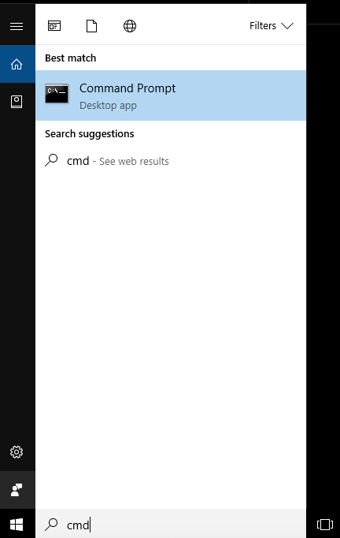
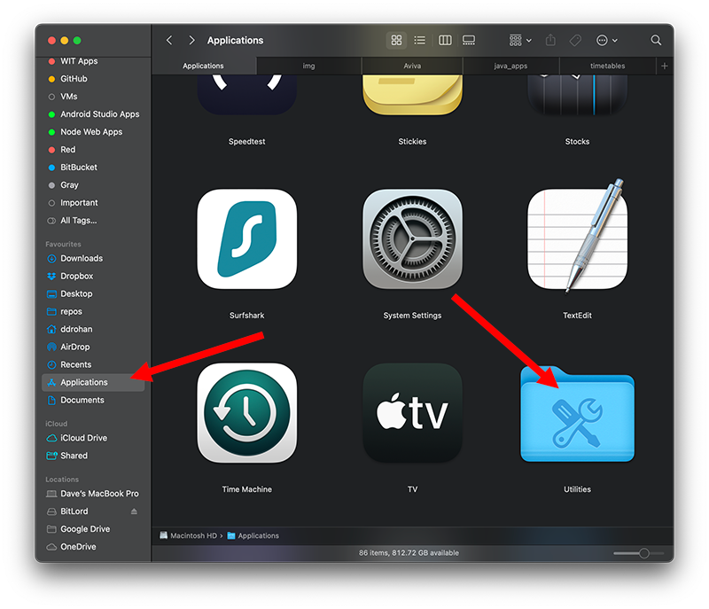
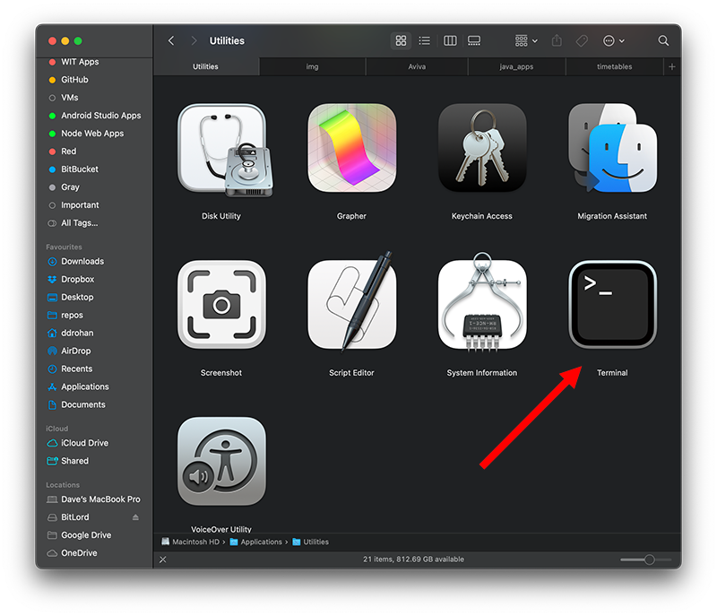

# 2: Preparation

**NOTE: This entire lab is only for installing Java and IntelliJ on your own personal computers.  If you are using the university computers, please move onto lab08b.**

## Windows - Command Prompt

Launch the command prompt: 

In the next step, we will use this to verify that your JDK installed successfully.

## Mac - Terminal 

If you are using a Mac, you can launch your Terminal.

Select `Finder->Applications->Utilities`

and within `Utilities` launch `Terminal`

In the next step, we will use this to verify that your JDK installed successfully.
