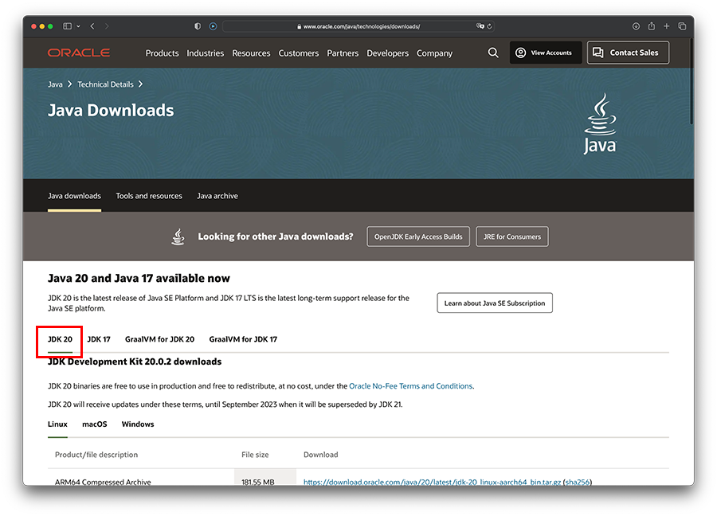
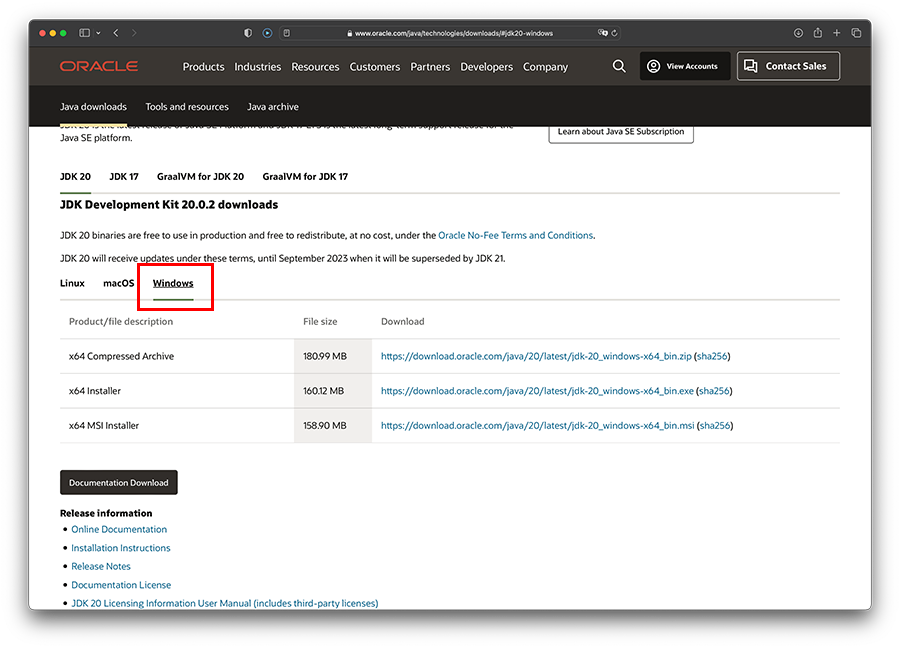
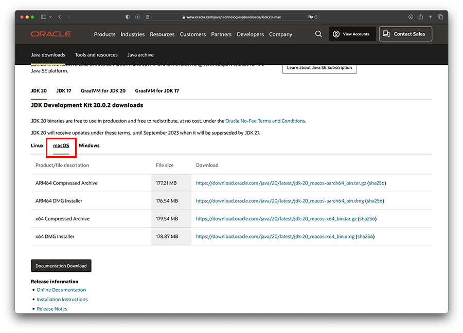
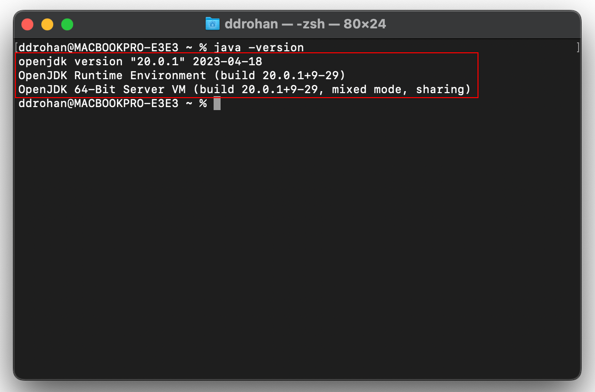

# 3: Install Java JDK

Visit this page:

- <https://www.oracle.com/technetwork/java/javase/downloads/index.html>

We are going to install the latest version of the JDK.  Click on the JDK Download link
that best matches your operating system:

## For Windows

A screen similar to this will be displayed:

Scroll down and select the executable version `.exe` (the installer, not the compressed archive) most suitable for your operating system:

## For Mac

A screen similar to this will be displayed:

Scroll down and select the `.dmg` (the installer, not the compressed archive) most suitable for your Mac operating system:

Once the `exe/dmg` file is downloaded, follow the steps to install it on your computer. 

To check if it is installed ok - you should type in the following command into the command prompt/terminal window we opened earlier

~~~
java -version
~~~

If your install was successful, you should get something like this:

## Windows
~~~
C:\Users\ddrohan>java -version
java version "20.0.1" 2023-04-18
Java(TM) SE Runtime Environment (build 20.0.1+9-29)
Java HotSpot(TM) 64-Bit Server VM (build 20.0.1+9-2, mixed mode, sharing)

C:\Users\ddrohan>
~~~

## Mac

**NOTE :** if it isn't displaying the version you just installed, try closing the command prompt, then reopen it and try the command again.  If this doesn't work, it is typically a problem with your environmental variables; you lecturer will be able to help you with this.

You have just installed the JDK and it can be found in this windows location (assuming you selected the default locations when installing the kit):

`C:\Program Files\Java\jdk<version>`

On Mac OS X, the default location for the JDK (Java Development Kit) is `/Library/Java/JavaVirtualMachines/jdk<version>.jdk/Contents/Home/`

where `<version>` is the version number of the JDK you have installed.

