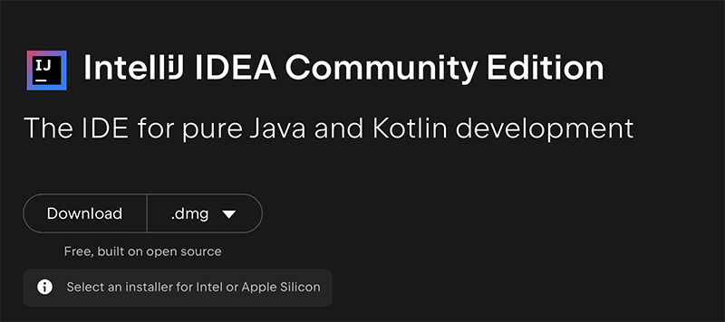
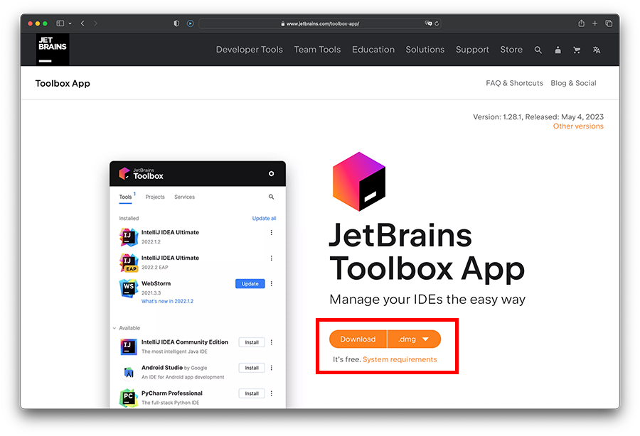
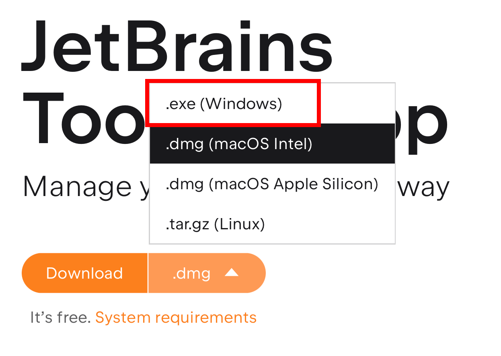
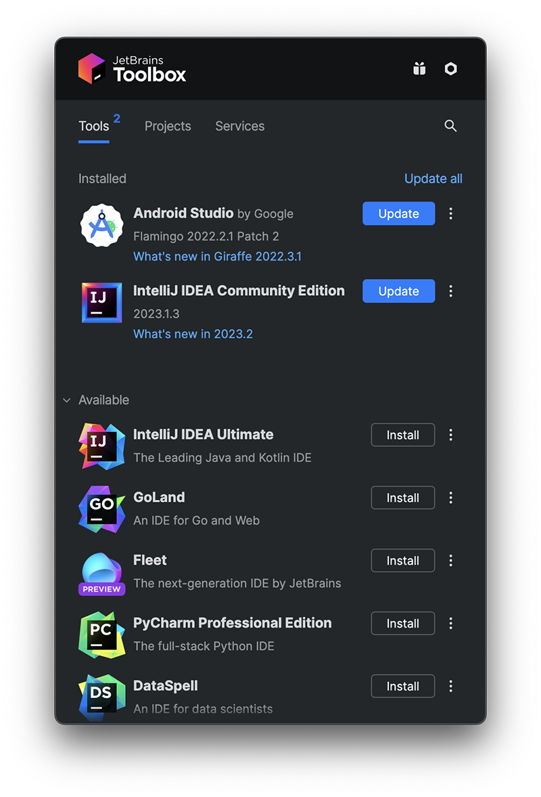
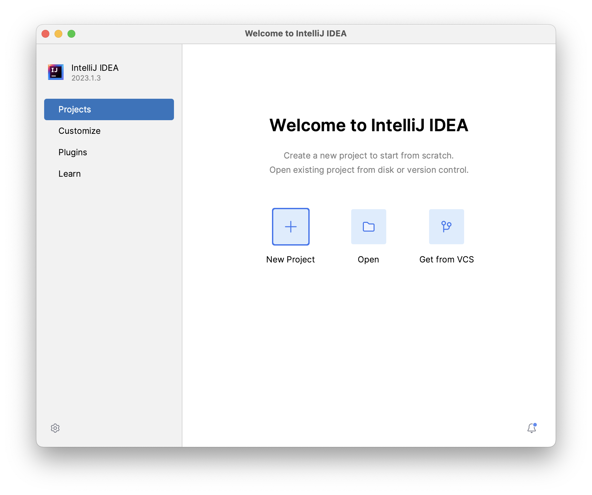

# 4: Install IntelliJ Idea

To date we have been using Processing as our editor. 

Now, we will move to a professional Java Integrated Development Environment (IDE) called **IntelliJ IDEA**.

Before downloading, if you wish, you can apply for a new `Jetbrains` student account using this link:

- <https://www.jetbrains.com/community/education/#students>

Make sure to ___use your SETU email address___, as this will allow you to gain access to the professional versions of ALL Jetbrains products.

Now proceed to download and install the `Community Edition` version of the IntelliJ IDE, which is FREE:

(Just scroll down a bit and pick the relevant `exe\dmg` download....)

- <https://www.jetbrains.com/idea>
  

I'd also recommend installing the ToolBox App from 

<https://www.jetbrains.com/toolbox-app/>

as this will assist you in keeping any and all of your Jetbrains IDEs and Tools up to date.

**NOTE :** This is purely optional and not a requirement - IntelliJ will still work perfectly without this tool, you will just need to check for updates manually.
  
  Pick the relevant `exe\dmg` download again:
  

And the ToolBox looks something like this:
  
## Launching IntelliJ

Now that IntelliJ is installed, launch it. 

You may be asked to import settings...choose *Do not import settings*.

A welcome screen should now appear:

From here, you can work with projects, choose to customise the look-and-feel of IntelliJ and learn more about the IntelliJ IDEA.  

We will create a `New Project` in the next lab, but for now - Well Done!

