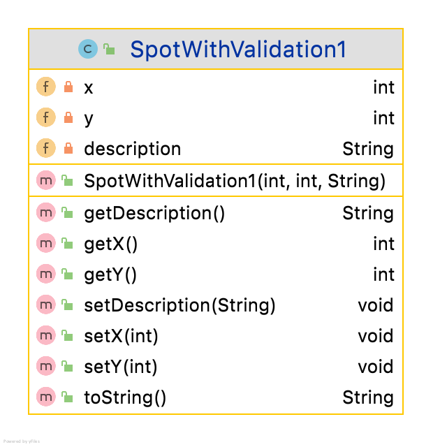

Validation in classes - Older Method

We look at a class with the following UML

We have three fields and we wish to implement the following validation rules on them:

 - **x** and **y** should be between 0 and 200. Default to 0.
 - **description** (a String)  should be max length 20.  Default to first 20 chars

~~~

public class SpotWithValidation1 {
    private  int x, y;  // x and y should be between 0 and 200. Default to 0.
    private String description; // should be max length 20. Default to first 20 chars
    public SpotWithValidation1(int x, int y, String description) {
        if (x >=0 && x <=200)
            this.x = x;
        else
            this.x = 0;
        if (y >=0 && y <=200)
            this.y = y;
        else
            this.y = 0;
        if (description.length() <=20)
            this.description = description;
        else this.description = description.substring(0,20);
    }

    public int getY() {
        return y;
    }

    public void setY(int y) {
        if (y >=0 && y <=200)
            this.y = y;
    }

    public int getX() {
        return x;
    }

    public void setX(int x) {
        if (x >=0 && x <=200)
            this.x = x;
    }
    public String getDescription() {
        return description;
    }

    public void setDescription(String description) {
        if (description.length() <=20)
            this.description = description;
    }
    public String toString() {
        return  "Value of x : " + x +
                "  Value of y : " + y +
                "  Value of description is : "+ description + "\n";
    }
}
~~~

Note:

1. in the declarations, we only declare, we do not give initial values. This is all done in the constructor,
2. The full logic of the validation (for each field)is used in the constructor and the setter. 
3. Indeed the code in the constructor and setter is similar, except that there is no **else** part in the setter.
4. After the constructor has been called, each field must have a valid value. It follows that, if the constructor is supplied with an invalid data, then the constructor must be ready to give it a valid, 'default' value.
5. Using this method, all of this is done in the constructor. 

