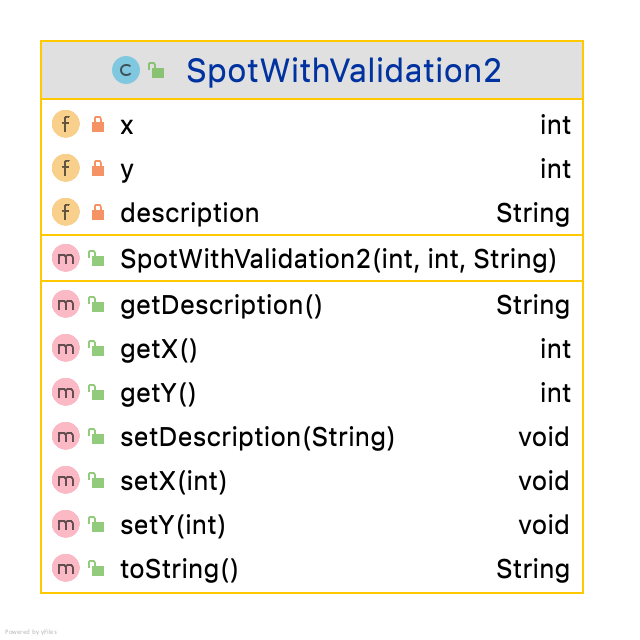

Validation in classes - More Modern  Method

We look at a class with the following UML

(This is very similar to the  previous **SpotWithValidation1** class - only the implementation doffers. 

Similarly, We have three fields and we wish to implement the following validation rules on them:

 - **x** and **y** should be between 0 and 200. Default to 0.
 - **description** (a String)  should be max length 20.  Default to first 20 chars

~~~

/*METHOD 2 -
* This is a more modern method of validation.
* This is the method we will use.
* */
public class SpotWithValidation2 {
    private  int x = 0; //these are used as the
    private int y = 0; // x and y should be between 0 and 200. Default to 0.
    private String description; // should be max length 20. Default to first 20 chars
    public SpotWithValidation2(int x, int y, String description) {
        setX(x);
        setY(y);
        if (description.length() <=20)
            this.description = description;
        else this.description = description.substring(0,20);
    }

    public int getY() {
        return y;
    }

    public void setY(int y) {
        if (y >=0 && y <=200)
            this.y = y;
    }

    public int getX() {
        return x;
    }

    public void setX(int x) {
        if (x >=0 && x <=200)
            this.x = x;
    }
    public String getDescription() {
        return description;
    }

    public void setDescription(String description) {
        if (description.length() <= 20)
            this.description = description;
    }
    public String toString() {
        return  "Value of x : " + x +
                "  Value of y : " + y +
                "  Value of description is : "+ description + "\n";
    }
}

~~~

Note:

1. In the declaration part (of the fields), we give the fields an initial value. This acts as the default value.
2. We write the setter as before, (with no else). There is no change here.
3. The constructor shows the main change. For the case of the integer variables, we simply call the setters. Recall that the setters only make a change when the proposed new value is valid. Using this method, if the proposed value is valid, then the setter logic will be used, otherwise no change is made so the original value assigned at declaration time is the value assigned at the completion of the constructor.
4. Note that in the case of Strings,  the default value (in this case) is based on the proposed value, whether or not it is valid so we need to use the previous method. Examine why this is necessary. 

